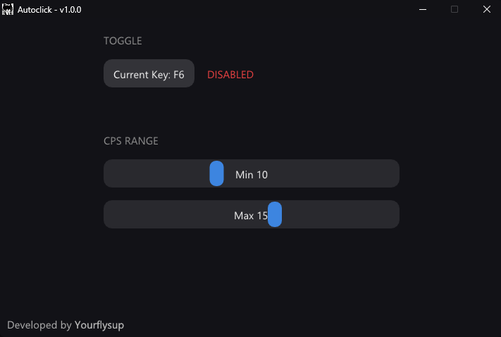

# Autoclick

This is a simple auto-clicker that saves you from mashing the mouse yourself. When it is enabled and you hold the left mouse button, it clicks for you at anywhere from 0 up to 25 CPS.

> [!NOTE]
> For **Minecraft Bedrock Edition** (Minecraft for Windows) users, it works properly on the latest version **1.21.131** as of today.

> For **Developers**, [ImGui](https://github.com/ocornut/imgui) is not included in this repository and must be provided by the user.

## Quick Features

- **CPS Range**: Goes from 0 up to 25 clicks per second, so you can set whatever speed you are comfortable with.
- **Activation**: Hold the left mouse button and use your own toggle hotkey to turn the clicker on or off.

## Setup

1. Download the latest release from [Releases](https://github.com/yourflysup/autoclick/releases).
2. Download and run `Autoclick.exe`.
3. Hit your hotkey to toggle (default: F6), hold LMB (Left Mouse Button) and enjoy!

## Preview

  

---

> [!WARNING]
> This project is provided for **educational and personal use only**.
>
> Use it responsibly and respect the rules of the software you use it with.

